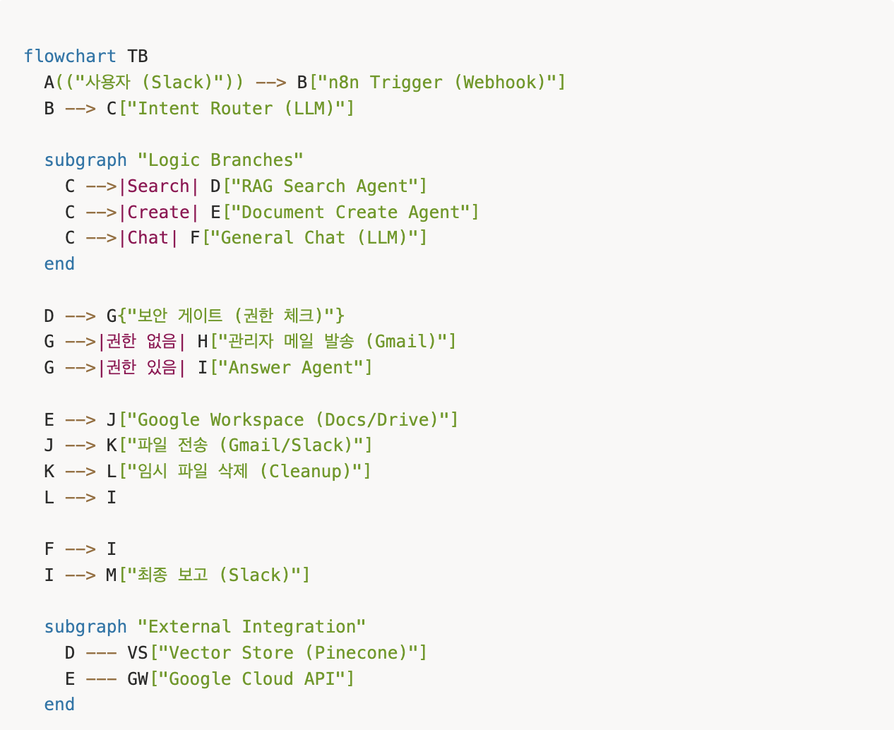
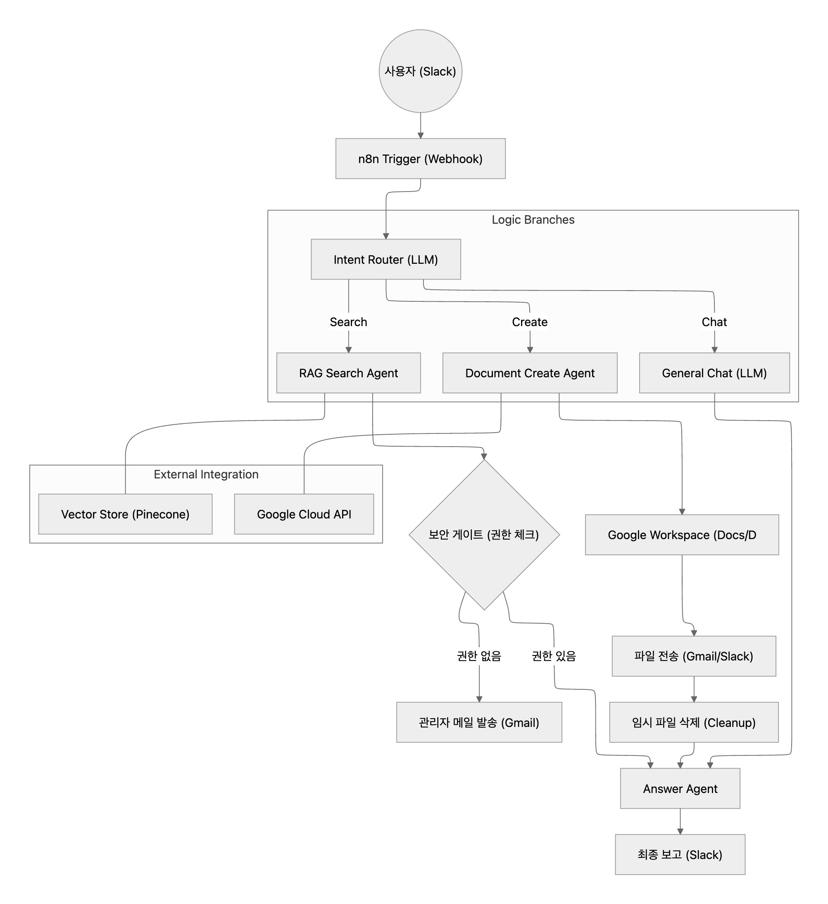
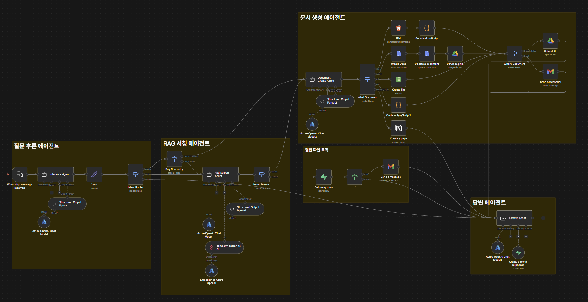
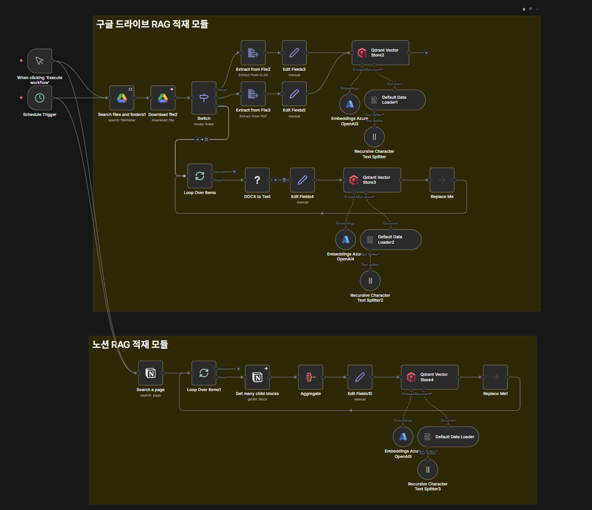
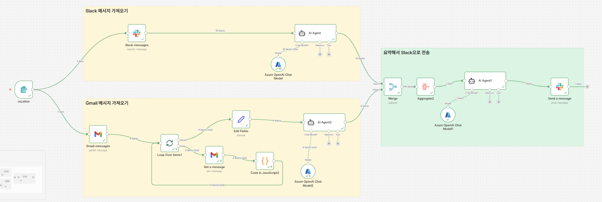
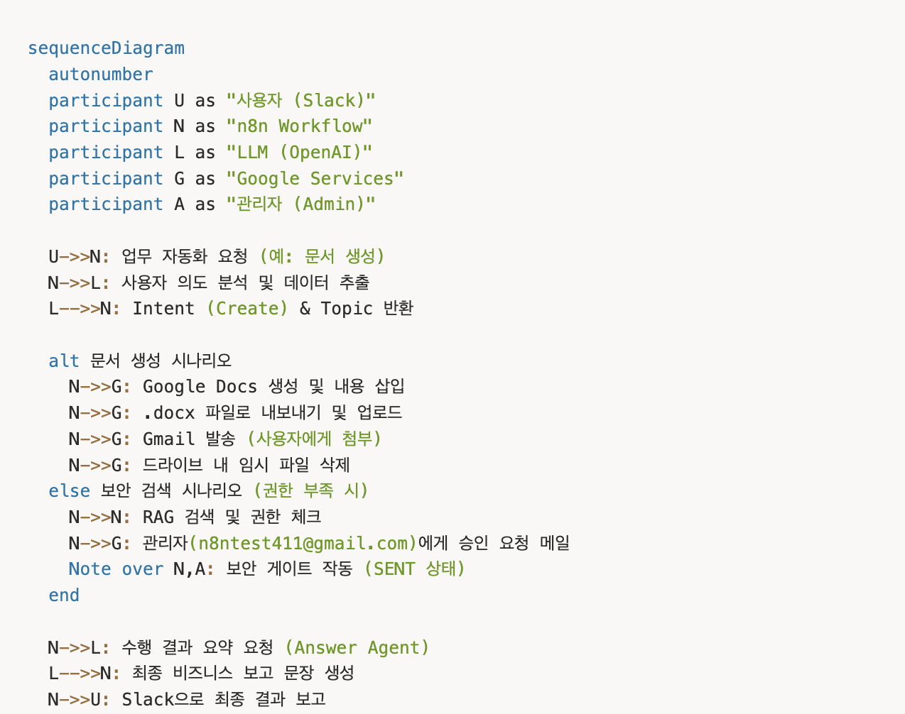
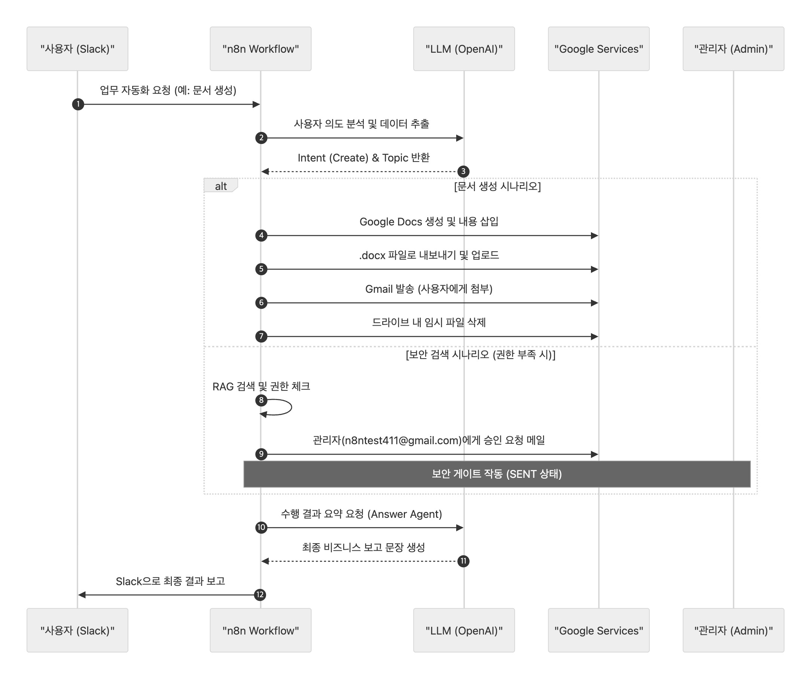

# Baton: Organizational Workflow Automation AI Assistant
Reducing knowledge-search costs and onboarding delays through AI-powered workflow automation.

---

## Overview

Baton is an AI-powered organizational assistant designed to reduce workflow interruptions, document search overhead, and onboarding delays.

The platform combines Retrieval-Augmented Generation (RAG), workflow automation, and enterprise integrations to help employees quickly access internal knowledge, generate documents, and manage accumulated communications.

---

## Problem Statement

Organizations frequently experience productivity loss due to:

- Internal document search overhead
- Knowledge transfer delays
- Information fragmentation
- Post-vacation workload accumulation

This project was developed to automate these processes using LLM-based workflow orchestration.

---

## Tech Stack

### AI

- Azure OpenAI
- LangChain
- Embedding Models
- RAG

### Automation

- n8n
- JavaScript

### Services

- Google Drive
- Google Docs
- Gmail
- Slack
- Notion

### Database

- Qdrant Vector Database

---

## System Architecture

---

### Knowledge Search

Natural language search over internal organizational documents using RAG.

### Document Generation

Automatic generation and distribution of documents through Google Workspace.

### Vacation Recovery Assistant

Summarizes unread Gmail and Slack messages and generates prioritized action items.

### Knowledge Base Synchronization

Automatically indexes Google Drive and Notion content into a centralized vector database.

--- 

## Workflow Overview

---

## RAG Pipeline

---

## Vacation Recovery Workflow

---

## Sequence Diagram

--- 

## My Contributions

- Designed workflow architecture
- Implemented RAG retrieval pipeline
- Developed intent-routing logic
- Built permission escalation workflow
- Integrated Google Workspace services
- Implemented Slack automation workflows
- Designed fault-tolerant workflow execution

---

## Lessons Learned

- Enterprise workflow automation
- Retrieval-Augmented Generation (RAG)
- Vector database integration
- Multi-service API orchestration
- LLM workflow design
- AI-powered business process automation
